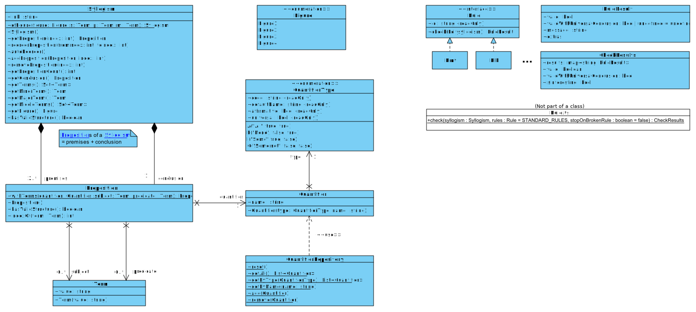

# Syllogismator

*Syllogism and polysyllogism validation tool.*

This application is developed with [React](https://react.dev/) and bundled with [Vite](https://vite.dev/).

## Project structure

* The `public` directory contains static files which are served to the client through HTTP (e.g. images and translation files)
* The `src` directory contains the code of React components and business classes.
* The `test` directory contains all unit tests.

### Business classes

Business classes are located in the `src/model` directory. The class diagram is shown below:

Concrete syllogism validation rules are implemented in `RuleImpl.ts`.

For simplicity, syllogisms and polysyllogisms are referred to as "syllogisms" in the code and the documentation, as they are implemented in the same way.
A syllogism with 3 propositions (2 premises and a conclusion) is referred to as "simple syllogism".

## Running the application

* Development: `npm run dev`
* Production: `npm run build`
